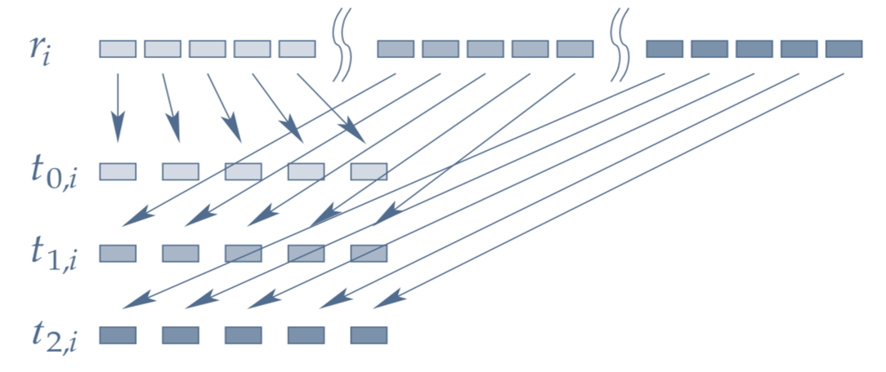
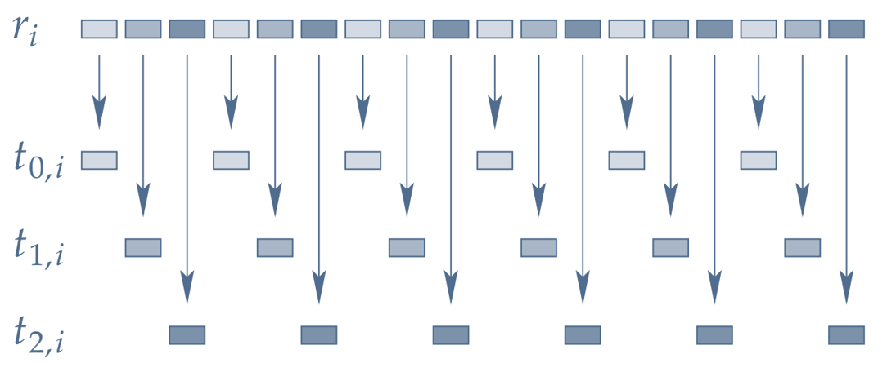

# Parallel Random Number Generation

---

::::{important} TL;DR ✨

This chapter shows why naïvely adding `std::execution::par` to serial RNG code doesn’t work. You’ll compare four parallelization strategies—*random seeding*, *parametrization*, *block splitting*, and *leapfrogging*—and see their trade‑offs.

We then set the stage for Ranx: STL‑like `generate()`/`generate_n()` with `ranx::bind()`, using *block splitting* on CPUs and *leapfrogging* on GPUs to guarantee reproducible sequences for a given seed, independent of backend or thread count.

If you already know these patterns and the Ranx approach, you can jump ahead to the \
[next chapter »](./04_working_with_ranx.md).
::::

Let’s start with transforming [the code](./02_serial_random_number_generation.md#generate_n_w_bind)  we introduced in the previous chapter into a parallel version.

## C++17 parallel algorithms

*C++17* introduced parallel algorithms using [execution policies](https://en.cppreference.com/w/cpp/algorithm/execution_policy_tag_t.html). So, let's see if we can use it to run our exiting code in parallel.

Let's first include the necessary headers and function templates for different output formats:

```{code-cell} cpp
#include <iostream>    // <-- std::cout and std::endl
#include <iomanip>     // <-- std::setw()
#include <vector>      // <-- std::vector
#include <random>      // <-- std::t19937 and std::uniform_int_distribution
#include <algorithm>   // <-- std::generate() and std::generate_n()
#include <execution>   // <-- std::execution::par
#include <g3p/gnuplot> // <-- g3p::gnuplot

// load the Threading Building Blocks library that under the hood
// does the actual parallelization
#pragma cling load("libtbb.so.2")

// function template to print the numbers
template <typename RandomIterator>
void print_numbers(RandomIterator first, RandomIterator last)
{   auto n = std::distance(first, last);
    for (size_t i = 0; i < n; ++i)
    {   if (0 == i % 10)
        std::cout << '\n';
        std::cout << std::setw(3) << *(first + i);
    }
    std::cout << '\n' << std::endl;
}

// function template to render two randograms side-by-side
template<typename Gnuplot, typename RandomIterator>
void randogram2
(   const Gnuplot& gp
,   RandomIterator first
,   RandomIterator second
,   size_t width = 200
,   size_t height = 200
)
{   gp  ("set term pngcairo size %d,%d", width * 2, height)
        ("set multiplot layout 1,2")
        ("unset key; unset colorbox; unset tics")
        ("set border lc '#333333'")
        ("set margins 0,0,0,0")
        ("set bmargin 0; set lmargin 0; set rmargin 0; set tmargin 0")
        ("set origin 0,0")
        ("set size 0.5,1")
        ("set xrange [0:%d]", width)
        ("set yrange [0:%d]", height)
        ("plot '-' u 1:2:3:4:5 w rgbimage");
    for (size_t i = 0; i < width; ++i)
        for (size_t j = 0; j < height; ++j)
        {   int c = *first++;
            gp << i << j << c << c << c << "\n";
        }
    gp.end() << "plot '-' u 1:2:3:4:5 w rgbimage\n";
    for (size_t i = 0; i < width; ++i)
        for (size_t j = 0; j < height; ++j)
        {   int c = *second++;
            gp << i << j << c << c << c << "\n";
        }
    gp.end() << "unset multiplot\n";
    display(gp, false);
}
```

### 1<sup>st</sup> attempt

Because *C++11* random engines are not thread safe, to prevent data race accessing our engine, we pass a copy of the engine rather than reference and see what happens. Here's our first attempt side-by-side with the serial code and the resulting randograms for the comparisons:

::::{tab-set}
:label: cpp17_parallel_rng_1st_tab

:::{tab-item} C++17 parallel algorithm

```{code-cell} cpp
:label: cpp17_generate_n_1st

const unsigned long seed{2718281828};
const auto n{100};
std::vector<int> v(n);
std::mt19937 r(seed);
std::uniform_int_distribution<int> u(10, 100);

std::generate_n
(   std::execution::par
,   std::begin(v)
,   n
,   std::bind(u, r) // <-- copy of r
);

print_numbers(std::begin(v), std::end(v));
```
:::

:::{tab-item} Serial version
```{code-cell} cpp

const unsigned long seed{2718281828};
const auto n{100};
std::vector<int> v(n);
std::mt19937 r(seed);
std::uniform_int_distribution<int> u(10, 100);

std::generate_n
(
    std::begin(v)
,   n
,   std::bind(u, std::ref(r))
);

print_numbers(std::begin(v), std::end(v));
```
:::

:::{tab-item} Randograms
```{code-cell} cpp
:label: 1st_attempt_randograms

const size_t w{240}, h{240}, n{w * h};
std::vector<int> parallel(n), serial(n);
std::mt19937 pr(seed), sr(seed);              // start with the same seed
std::uniform_int_distribution<int> c(0, 255); // for rgb

// parallel version passing copy of the engine
std::generate_n(std::execution::par
,               std::begin(parallel), n, std::bind(c, pr));
std::generate_n(std::begin(serial), n, std::bind(c, std::ref(sr)));

// our gnuplot instance
g3p::gnuplot gp;
// rendering two randograms side-by-side for comparison
randogram2(gp, std::begin(parallel), std::begin(serial), w, h);
```

:::
::::

Not quite the output we’ve expected but if you think about it, that was obvious. By using a copy of the engine, each thread initiates with a new instance of the engine and restarts with the same number in the sequence, producing a repeating pattern as you can see in the left randogram. 

### 2<sup>nd</sup> attempt

Let's forget about the data race possibility for a moment and pass a reference to the engine, exactly like the way we did for the serial version, to see if that solves the problem. Here's our second attempt in the same format:

::::{tab-set}
:label: cpp17_parallel_rng_2nd_tab

:::{tab-item} C++17 parallel algorithm

```{code-cell} cpp
:label: cpp17_generate_n_2nd

const unsigned long seed{2718281828};
const auto n{100};
std::vector<int> v(n);
std::mt19937 r(seed);
std::uniform_int_distribution<int> u(10, 100);

std::generate_n
(   std::execution::par
,   std::begin(v)
,   n
,   std::bind(u, std::ref(r)) // <-- reference of r
);

print_numbers(std::begin(v), std::end(v));
```
:::

:::{tab-item} Serial version
```{code-cell} cpp

const unsigned long seed{2718281828};
const auto n{100};
std::vector<int> v(n);
std::mt19937 r(seed);
std::uniform_int_distribution<int> u(10, 100);

std::generate_n
(
    std::begin(v)
,   n
,   std::bind(u, std::ref(r))
);

print_numbers(std::begin(v), std::end(v));
```
:::

:::{tab-item} Randograms
```{code-cell} cpp

const size_t w{240}, h{240}, n{w * h};
std::vector<int> parallel(n), serial(n);
std::mt19937 pr(seed), sr(seed);              // start with the same seed
std::uniform_int_distribution<int> c(0, 255); // rgb values (0-255)

// parallel version passing reference of the engine
std::generate_n(std::execution::par,
                std::begin(parallel), n, std::bind(c, std::ref(pr)));
// serial version
std::generate_n(std::begin(serial), n, std::bind(c, std::ref(sr)));


// rendering two randograms side-by-side for comparison
randogram2(gp, std::begin(parallel), std::begin(serial), w, h);
```
:::

::::

:::{seealso} Exercise 🛠️

Rerun the parallel version several times to see if you always get the same results.
:::

At first glance, judging by the the short output from the first two tabs, it seems without much efforts we hit the jackpot. But that's because we only generated 100 random numbers. So, there's a chance you get the exact same result as the serial version, even by repeating several times.

But as you can see in the generated randograms, the parallel version on the left is different from the serial version on the right, despite using the same seed for both. The parallel version generates similar but different sequence of numbers.

But that's not the actual problem. The real problem is that the parallel version is even slower than the serial version! Let's first increase the number of random numbers and then time them:

```{code-cell} cpp
const size_t n = 1'000'000;
serial.resize(n);
parallel.resize(n);
```
::::{tab-set}
:label: cpp17_parallel_benchmark_tab

:::{tab-item} Serial benchmark

```{code-cell} cpp
%%timeit
std::generate_n
(
    std::begin(serial)
,   n
,   std::bind(u, std::ref(sr))
);
```

:::

:::{tab-item} Parallel benchmark

```{code-cell} cpp
%%timeit
std::generate_n
(   std::execution::par
,   std::begin(parallel)
,   n
,   std::bind(u, std::ref(pr))
);
```

:::

::::

That proves we need better strategies to generate random numbers in parallel and that's the subject of the next section.

## Parallel random numbers, the right way

Below you can find four proven methods to introduce parallelism into ARNGs. These are general techniques that can be used equally well in shared memory, distributed memory and heterogenous setups.

::::{grid} 1 1 2 2
:numbered:

:::{card}
:header: 1️⃣ [Random seeding](#random_seeding)
:footer: [Compare performance »](#benchmark_tab)

All parallel threads use the same engine but a different *random* seed.

---

✅ Good scaling \
🔻 Possible correlations in subseqs \
🔻 Overlapping of subseqs \
🔻 Cannot [play fair](./01_randomness_primer.md#fairplay)
:::

:::{card}
:header: 2️⃣ [Parametrization](#parametrization)
:footer: [Compare performance »](#benchmark_tab)

All parallel threads use the same engine but different *parameters* for each thread.

---

✅ No overlapping \
🔻 Multiple streams must be supported \
🔻 Possible correlations in streams \
🔻 Cannot [play fair](./01_randomness_primer.md#fairplay)
:::

:::{card}
:header: 3️⃣ [Block splitting](#block_splitting)
:footer: [Compare performance »](#benchmark_tab)

Each block in the sequence is generated by a different thread. 

(block_splitting_img)=


---

✅ No overlapping \
✅ No correlations \
✅ [Plays fair](./01_randomness_primer.md#fairplay) \
🔻 Need jump-ahead support \
🔻 Shortened period \
🔻 Need modified [`generate()`](https://en.cppreference.com/w/cpp/algorithm/generate)

:::

:::{card}
:header: 4️⃣ [Leapfrog](#leapfrog)
:footer: [Compare performance »](#benchmark_tab)

Consecutive random numbers are generated by different threads.

(leapfrog_img)=


---

✅ No overlapping \
✅ No correlations \
✅ [Plays fair](./01_randomness_primer.md#fairplay) \
🔻 Need jump-ahead support \
🔻 Shortened period \
🔻 Need modified [`generate()`](https://en.cppreference.com/w/cpp/algorithm/generate) \
🔻 Prone to [false sharing](wiki:False_sharing) on CPU
:::

::::

(random_seeding)=
### Random seeding

In random seeding, all parallel threads use the same engine but a different *random* seed. One way to do this is to use the thread numbers as seed. Unfortunately, there’s no provisions in [*C++11's concurrency library*](https://en.cppreference.com/w/c/thread.html) to get the thread numbers. So, we have to hash the thread IDs instead and use them to seed the instantiated [`thread-local`](https://en.cppreference.com/w/c/thread/thread_local) engines. That means we get completely different sequence of random numbers on each invocation.

::::{tab-set}
:label: random_seeding_tab

:::{tab-item} Random seeding

```{code-cell} cpp
:label: random_seeding_code
#include <thread>   // <-- std::hash and std::thread

const unsigned long seed{2718281828};
const auto n{100};
std::vector<int> v(n);
std::mt19937 r(seed);
std::uniform_int_distribution<int> u(10, 99);

std::hash<std::thread::id> hasher;
std::generate_n
(   std::execution::par
,   std::begin(v)
,   n
,   [&]()
{   thread_local std::mt19937 r(hasher(std::this_thread::get_id()));
    return u(r);
}
);

print_numbers(std::begin(v), std::end(v));
```
:::

:::{tab-item} Serial version
```{code-cell} cpp
:label: serial_rng_code
//

const unsigned long seed{2718281828};
const auto n{100};
std::vector<int> v(n);
std::mt19937 r(seed);
std::uniform_int_distribution<int> u(10, 99);


std::generate_n
(
    std::begin(v)
,   n
,   std::bind(u, std::ref(r))
);


print_numbers(std::begin(v), std::end(v));
```
:::

:::{tab-item} Randograms
```{code-cell} cpp

const size_t w{240}, h{240}, n{w * h};
std::vector<int> parallel(n), serial(n);
std::mt19937 pr(seed), sr(seed);              // start with the same seed
std::uniform_int_distribution<int> c(0, 255); // rgb values (0-255)

// random seeding
std::generate_n
(   std::execution::par
,   std::begin(parallel)
,   n
,   [&]()
{   thread_local std::mt19937 pr(hasher(std::this_thread::get_id()));
    return c(pr);
}   );
// serial version
std::generate_n(std::begin(serial), n, std::bind(c, std::ref(sr)));


// rendering two randograms side-by-side for comparison
randogram2(gp, std::begin(parallel), std::begin(serial), w, h);
```
:::

::::

(parametrization)=
### Parametrization

In parametrization, all parallel threads use the same type of generator but with different *parameters* for each thread. For example, [LCG generators](wiki:Linear_congruential_generator) support an additive constant for switching to another stream, so called multiple streams. So, no overlapping occurs but there's a chance of correlations between streams. Like [random seeding](#random_seeding), generates different sequence of random numbers on each run. As [`std::mt19937`](https://en.cppreference.com/w/cpp/numeric/random/mersenne_twister_engine.html) doesn't support multiple streams, we'll switch to the [`pcg32`](wiki:Permuted_congruential_generator) generator provided by the Ranx library.

::::{tab-set}
:label: parametrization_tab

:::{tab-item} Parametrization

```{code-cell} cpp
:label: parametrization_code
#include <ranx/pcg/pcg_random.hpp> // <-- pcg32

const unsigned long seed{2718281828};
const auto n{100};
std::vector<int> v(n);
std::uniform_int_distribution<int> u(10, 99);


std::hash<std::thread::id> hasher;
std::generate_n
(   std::execution::par
,   std::begin(v)
,   n
,   [&]()
{   thread_local pcg32 r(seed, hasher(std::this_thread::get_id()));
    return u(r);
}
);

print_numbers(std::begin(v), std::end(v));
```
:::

:::{tab-item} Random seeding
```{embed} #random_seeding_code
```
:::

:::{tab-item} Serial version
```{embed} serial_rng_code
```
:::

:::{tab-item} Randograms
```{code-cell} cpp

const size_t w{240}, h{240}, n{w * h};
std::vector<int> parallel(n), serial(n);
std::mt19937 sr(seed);              // start with the same seed
std::uniform_int_distribution<int> c(0, 255); // rgb values (0-255)

// random seeding
std::generate_n
(   std::execution::par
,   std::begin(parallel)
,   n
,   [&]()
{   thread_local pcg32 r(seed, hasher(std::this_thread::get_id()));
    return c(pr);
}   );
// serial version
std::generate_n(std::begin(serial), n, std::bind(c, std::ref(sr)));


// rendering two randograms side-by-side for comparison
randogram2(gp, std::begin(parallel), std::begin(serial), w, h);
```
:::

::::

(block_splitting)=
### Block splitting
As shown in the following figure, in *block splitting* the sequence of an RNG is divided into equally-sized consecutive blocks that are generated by different threads:

```{figure} #block_splitting_img
:label: block_splitting_fig
:align: center
Parallelization by block splitting (source: [](https://github.com/rabauke/trng4/blob/master/doc/trng.pdf) )
```

This way, no overlapping or correlations occurs between streams at the expense of shortened period by a factor of number-of-threads. If the block size is larger than the [cache line](wiki:CPU_cache#Cache_entries), which is usually the case for large data, no [false sharing](wiki:False_sharing) happens as well.

For threads to skip the block size, there should be an efficient way of jumping-ahead in the sequence which is supported by some engines, most notably [LCGs](wiki:Linear_congruential_generator) generators. But that also requires a modified [`std::generate()`](https://en.cppreference.com/w/cpp/algorithm/generate) to call the engine's skipping function. To that end, we use the Ranx library, which provides both the engine (i.e. [`PCG family`](wiki:Permuted_congruential_generator)) and the alternatives to `std::generate()/std::generate_n()` functions that use *block splitting* for parallelization using <wiki:OpenMP> on CPUs.

If we match *block splitting* method by a distribution that doesn't discard any values generated by the engine, then it can [plays fair](./01_randomness_primer.md#fairplay) as well. The Ranx library includes the distributions provided by [TRNG](https://github.com/rabauke/trng4) that can do that. We'll cover that in the [next chapter »](./04_working_with_ranx.md).

(leapfrog)=
### Leapfrog

In leapfrog method, the consecutive random numbers are generated by different threads. As the values sitting next to each other on a [cache line](wiki:CPU_cache#Cache_entries) ([](#leapfrog_fig)), are each generated by a different thread, it's highly susceptible to [false sharing](wiki:False_sharing) on CPU but not as much on GPU.

```{figure} #leapfrog_img
:label: leapfrog_fig
:align: center
Parallelization by leapfrogging (source: [](https://github.com/rabauke/trng4/blob/master/doc/trng.pdf) )
```

The other pros and cons are exactly like the [*block splitting*](#block_splitting). The Ranx library relies on *leapfrog* method to generate the code on <wiki:CUDA> and <wiki:ROCm> platforms. We'll cover that in the [next chapter »](./04_working_with_ranx.md).

## Concluding remarks

In this chapter we investigated why dropping `std::execution::par` into otherwise-correct serial RNG code fails to deliver: passing a copy of the engine yields repeating patterns, passing reference to the engine creates races and nondeterminism, and even when it “works” it often runs slower. We then surveyed four established strategies for parallel RNG—[*random seeding*](#random_seeding), [*parametrization*](#parametrization), [*block splitting*](#block_splitting), and [*leapfrogging*](#leapfrog)—highlighting their trade‑offs.

These observations motivate the design behind Ranx: use [*block splitting*](#block_splitting) on CPUs (<wiki:OpenMP>) and [*leapfrogging*](#leapfrog) on GPUs (<wiki:CUDA>/<wiki:ROCm>/[oneAPI](wiki:OneAPI_(compute_acceleration))), paired with distributions that avoid discarding values so results can play fair. Crucially, Ranx wraps the engine+distribution into a device‑compatible functor and applies jump‑ahead/stride patterns so that, given the same seed, you get reproducible sequences independent of thread count or backend.

In the next chapter, we’ll put this into practice: replacing `std::generate(_n)` with Ranx’s counterparts and using `ranx::bind()` to write code once and obtain identical outputs across <wiki:OpenMP>, <wiki:CUDA>, <wiki:ROCm>, and [oneAPI](wiki:OneAPI_(compute_acceleration)).


